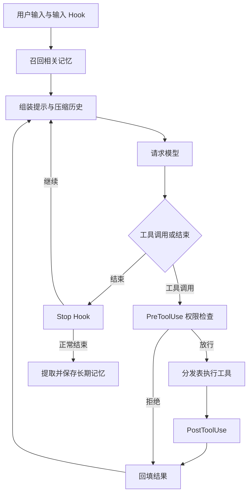

# Car Agent

使用 Python 和 Anthropic Messages API 构建的命令行 Agent，自行实现运行循环，支持工具执行、任务规划、子任务委派、技能加载、上下文压缩和跨会话记忆。

项目面向车载 Agent 的基础能力建设，目前是通用编程助手，尚未接入车辆控制、导航或车书问答服务。

## 快速开始

需要 Python 3.11+ 和 uv。在项目根目录安装依赖：

```bash
uv sync
```

创建 `.env`：

```dotenv
ANTHROPIC_API_KEY=替换为你的密钥
MODEL_ID=替换为可用模型ID
MEMORY_ENABLED=true
# 自定义兼容服务可配置：
# ANTHROPIC_BASE_URL=https://your-api-endpoint
```

启动和测试：

```bash
uv run car-agent
uv run python -m unittest discover -s tests -v
```

已激活虚拟环境时，也可使用 `python src/car_agent/agent_loop.py`。请在项目根目录启动，文件操作、技能扫描和记忆存储均以启动目录为基础。

输入 `q` / `exit` 退出；运行中按 Ctrl+C 中断并退出，审批时按 Ctrl+C 仅拒绝本次操作。已执行的文件修改不会自动撤销。

交互终端中的后台日志会显示在输入行上方，自动恢复提示符并保留正在输入的文字；无需额外按回车。管道输入仍使用普通文本模式。

## 架构



模型选择工具和参数，程序负责权限、执行与状态管理。系统提示包含固定指令、召回记忆和技能目录；对话历史保存用户问题、模型回复和工具结果。

## 核心能力

| 能力 | 实现 |
|---|---|
| 工具分发 | Schema 描述能力，handler map 执行函数；同轮多工具按顺序运行 |
| 权限与 Hooks | 输入、执行前、执行后、结束四个扩展点；支持硬拒绝和用户审批 |
| 可见计划 | 最多 20 步、一个进行中状态；连续三轮未更新时提醒，终端展示进度 |
| 子 Agent | 独立对话、同步执行，只向父 Agent 返回最终摘要；共享工作区，禁止递归委派 |
| 技能加载 | 启动扫描 `skills/*/SKILL.md`，系统提示仅放名称和简介，全文按需加载 |
| 上下文压缩 | 大结果转存 → 旧消息裁剪 → 旧结果缩短 → 模型摘要，保护工具调用与结果配对 |
| 长期记忆 | Markdown 存储，相关性召回、候选校验、重复过滤和带快照的整理恢复 |
| 终端反馈 | 显示计划、工具目标摘要、父 Agent 正文和失败提示，子循环以 `[sub]` 标识 |

交互主 Agent 有 12 个工具；子 Agent 保留 7 个（不含 `todo_write`、`task` 和三个定时工具），定时回合不提供再次注册定时任务的工具：

| 工具 | 用途 |
|---|---|
| `bash` | 执行 Shell 命令，可通过 `run_in_background=true` 放到后台 |
| `read_file` / `write_file` / `edit_file` | 读取、创建或覆盖、替换文本 |
| `glob` | 按模式查找工作区文件 |
| `todo_write` | 更新本次任务计划 |
| `task` | 委派子 Agent |
| `load_skill` | 加载完整技能说明，内置 `code-review` |
| `compact` | 当前工具批次结束后归档并总结历史 |
| `schedule_cron` / `list_crons` / `cancel_cron` | 注册、查看和取消定时任务 |

记忆在每次主任务开始时召回：最多 50 条目录候选交给模型判断，最多选 5 条、正文总计不超过 6000 字符。正常结束后，只从本次用户原话提取长期候选，不从工具输出或助手回答推断用户事实。子 Agent 不独立召回或写入长期记忆。

## 目录结构

```text
src/car_agent/
├── agent_loop.py     # 主循环、统一执行入口与 CLI
├── config.py         # 配置与系统提示
├── tools.py          # 工具定义与基础实现
├── permissions.py    # 权限规则和审批
├── hooks.py          # 生命周期回调
├── display.py        # 终端输出
├── background.py     # 后台命令、完成通知和进程清理
├── scheduler.py      # Cron 校验、持久化、到期队列和串行交付
├── todo.py           # 计划状态与提醒
├── subagent.py       # 子任务委派
├── skill_loader.py   # 技能目录与加载
├── compact.py        # 上下文压缩与归档
├── memory.py         # 持久记忆
├── check_api.py      # API 检查辅助脚本
└── __init__.py       # 包入口
skills/code-review/SKILL.md
tests/               # 离线测试
```

`.env`、`.venv/`、`.memory/`、`.transcripts/` 和 `.task_outputs/` 已加入 Git 忽略规则。记忆用于跨会话复用，归档用于恢复历史细节；二者不自动互转，也不自动清理。

## 配置与边界

- **轮数与费用**：主循环和每个子任务默认各限 15 轮，在 `config.py` 调整。子任务、压缩摘要和记忆处理会额外调用 API，15 轮不是总调用上限。
- **上下文**：默认历史预算为 50000 字符，在 `compact.py` 调整；估算不含系统提示和工具定义。摘要可能遗漏细节，API 上下文超限最多补救重试一次。
- **权限**：文件工具访问工作区外需审批，bash 采用字符串和正则规则，没有完整沙箱隔离。bash 退出码尚未完整映射到 `is_error`。
- **执行**：规划、委派和技能使用由模型选择，不是强制工作流。工具调用按顺序分发，Bash 可显式后台执行；子 Agent 仍同步委派，TODO 不跨重启保存。
- **记忆**：可能误提取或误合并，当前无多进程写锁和自动忘记工具。设置 `MEMORY_ENABLED=false` 并重启可关闭召回与提取，保留已有文件。

## 使用示例

- **规划执行**：创建 `demo_poem.txt`，写入四句励志小诗，读取检查；先列计划，逐步更新并报告结果。
- **子任务**：用 `task` 委派子 Agent 检查测试框架，给出文件依据，全程只读。
- **技能**：加载 `code-review`，核对 README 与实现是否一致，说明依据与未覆盖范围。
- **压缩**：读取 README 和 pyproject.toml，调用 `compact` 整理历史，再说明项目用途。压缩会写本地归档。
- **记忆**：输入“我长期偏好 Python 使用四个空格缩进，请记住”；看到保存提示后重启，再问缩进偏好。

## 扩展与验证

新增工具时定义 Schema 和处理函数并注册；新增生命周期行为时注册 Hook；新增技能时添加 `skills/<name>/SKILL.md` 并重启。

离线测试使用模拟模型和临时目录，覆盖权限、计划、上下文隔离、技能加载、压缩配对及记忆恢复。测试验证程序逻辑，不保证真实模型每次都能正确规划、选择工具或总结事实。

## 后台命令

模型在 bash 参数中显式设置 `run_in_background=true` 时，主线程先执行权限 Hooks，再启动独立进程组，由后台线程等待结果。立即返回 `bg_id`；同批其他工具和后续模型轮次可以继续。默认仍同步，不按 install/test 等关键词自动猜测。

每轮请求模型前收集完成通知，以独立的 `task_notification` 文本消息加入历史，不重复使用原 `tool_use_id`。PostToolUse 对应启动结果，不表示命令已完成。父子通知按归属收集，子任务退出时剩余通知转交父 Agent。

默认最多同时运行 4 个后台命令，每个超时 600 秒，可在 `background.py` 调整。正常结束、超时及 CLI 退出（含 SIGTERM）会清理原进程组；它不是沙箱，另建会话的进程可能脱离管理。非零退出、超时、worker 异常作为失败通知返回。通知输出最多保留 200000 字节；临时输出文件在收集前由 worker 关闭。

后台结束不主动唤醒正在等待输入的 Agent，也不增加并行用户输入功能。若模型已结束回答，后续输入“检查后台结果”可触发收集；`q` 会终止仍运行的命令。状态仅在内存中，不跨重启恢复。SIGKILL 或进程崩溃无法保证执行清理。

测试：`在后台运行 sleep 3，然后查找当前目录所有 Markdown 文件。收到后台通知后再报告命令结果，尚未完成就如实说明。`

## 定时调度

通过 `schedule_cron(cron, prompt, recurring=true, durable=false)` 注册任务。本地时间匹配后先入队，Agent 空闲时自动启动独立对话，无需再次输入。调度线程检查时间，交付线程与终端回合共用锁，避免同时运行两个模型回合；终端输出可能穿插在输入提示旁，已经输入的问题会排队等待。

五段 Cron 为“分钟 小时 日 月 星期”，支持 `*`、`*/N`、单值、区间和逗号列表；星期 0/7 均为周日。日和星期同时受限时按传统 Cron 的 OR 规则匹配。示例：`0 9 * * *` 每天 09:00，`*/2 * * * *` 每两分钟。

- `recurring=false` 在下次匹配时交付一次；不是自然语言日期或秒级倒计时。
- `durable=true` 将任务定义和待交付状态保存至 `.scheduled_tasks.json`，原子替换文件；已加入 Git 忽略。默认仅内存，重启消失。
- 同一分钟不重复入队，未交付任务不会继续累积重复项。首次模型响应成功后确认交付，后续工具失败不重新交付整项任务。
- 交付前失败会重排，退避 5–300 秒；崩溃发生在模型接收后、状态确认前可能重复交付，因此不保证恰好一次执行。
- Agent 必须保持运行；不补跑停机期间错过的时间点，但恢复此前已到期且未确认交付的持久任务。
- 定时回合不自动提取或召回长期记忆，必要背景写在 prompt 中。需要人工审批的工具直接拒绝，Shell 标准输入关闭；原有 bash 规则仍不是沙箱。
- 子 Agent 和定时回合不提供定时管理工具。取消会移除未交付队列项，不撤销已开始操作。关闭 CLI 停止调度；正在进行的回合不保证完成。

测试：输入 `每两分钟执行一次 date，把日期结果告诉我；重启后保留这个定时任务。`，保持程序运行并观察 `[Scheduled]`。再输入 `列出所有定时任务` 或 `取消刚才的定时任务`。也可先用 `每分钟执行一次 date，只交付一次，不需要重启保留` 做短测试。

注册成功只代表建立时间规则；确认交付只代表模型收到任务；实际是否执行成功要看工具结果。定时触发会产生额外 API 调用。任务文件损坏时启动报错并保留原文件，当前没有多个 Agent 进程共享调度文件的并发保障。
