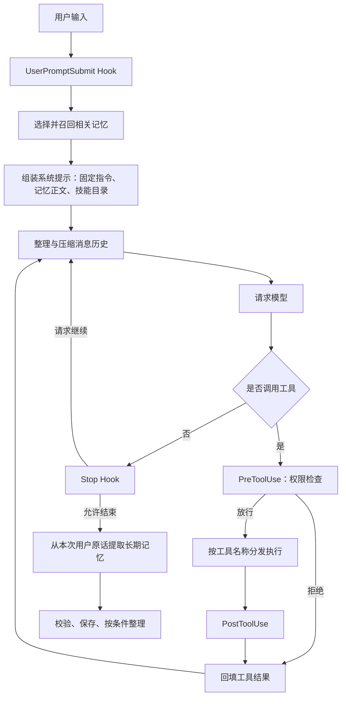

# Car Agent

一个使用 Python 构建的命令行 Agent，支持工具执行、任务规划、子任务委派、技能加载、上下文压缩和跨会话记忆。通过 Anthropic Messages API 与模型交互，使用自行实现的运行循环管理工具调用、权限检查和消息历史。

项目面向车载 Agent 的基础运行能力建设。目前实际运行的是通用编程助手，尚未接入车辆控制、车况读取、导航或车书问答服务。

## 快速开始

需要 Python 3.11 或更高版本和 uv。在项目根目录执行：

```bash
uv sync
```

创建本地 `.env`，配置模型：

```dotenv
ANTHROPIC_API_KEY=替换为你的密钥
MODEL_ID=替换为可用的模型ID
MEMORY_ENABLED=true
# 使用自定义兼容服务时配置：
# ANTHROPIC_BASE_URL=https://your-api-endpoint
```

启动：

```bash
uv run car-agent
```

也可以在已激活的项目虚拟环境中执行：

```bash
python src/car_agent/agent_loop.py
```

工作目录取决于启动程序时所在的位置；技能扫描、文件操作和本地记忆都以此为基础。建议始终在项目根目录启动。

输入 `q` 或 `exit` 退出。任务运行期间可按 Ctrl+C 中断并退出；权限审批输入处的 Ctrl+C 表示拒绝本次操作，Agent 仍可能继续运行。已经执行的文件修改不会自动撤销。

## 整体架构



模型负责选择工具和参数，程序负责执行、权限判断、状态管理及结果回填。父 Agent 每轮公开的文本会显示在终端；记忆提取发生在正常回答完成之后。

每次模型请求由三部分组成：

| 部分 | 内容 |
|---|---|
| `system` | 固定行为指令、当前召回的记忆正文、技能名称与简介 |
| `messages` | 用户问题、模型回复、工具调用和结果，包括按需加载的技能全文 |
| `tools` | 当前可用工具的名称、描述和参数 Schema |

## 工具系统

主 Agent 有 9 个工具，子 Agent 有 7 个工具。工具通过统一执行入口调用，并按模型响应中的顺序逐个执行。

| 工具 | 能力 | 主 Agent | 子 Agent |
|---|---|:---:|:---:|
| `bash` | 在工作目录中执行 Shell 命令 | ✓ | ✓ |
| `read_file` | 读取 UTF-8 文本，可限制行数 | ✓ | ✓ |
| `write_file` | 创建或覆盖文本文件，父目录须存在 | ✓ | ✓ |
| `edit_file` | 替换第一次匹配的文本 | ✓ | ✓ |
| `glob` | 按模式查找工作区内文件，最多显示 200 项 | ✓ | ✓ |
| `todo_write` | 创建和更新本次任务计划 | ✓ | — |
| `task` | 同步委派子 Agent，返回最终摘要 | ✓ | — |
| `load_skill` | 按注册名称读取完整技能说明 | ✓ | ✓ |
| `compact` | 请求在当前工具批次完成后总结历史 | ✓ | ✓ |

终端显示工具名和目标摘要，例如文件路径、命令或子任务描述；长摘要截断，不打印写入正文或大段工具结果。执行异常和权限拒绝会显示简短提示。工具异常被转为对应的 `tool_result`，供模型继续处理。

## 已实现的能力

### 权限与生命周期 Hooks

权限检查通过 `PreToolUse` 注册：先检查硬拒绝规则，再判断是否需要用户审批，未命中则执行。

- 文件工具解析绝对路径、`..` 和符号链接，访问工作区外需要批准。
- `glob` 仅返回工作区内的文件。
- bash 对部分危险命令硬拒绝，对匹配到的删除等命令询问用户。
- 审批展示完整目标，只有 `y` / `yes` 放行本次操作，默认拒绝。

| Hook | 时机 | 控制约定 |
|---|---|---|
| `UserPromptSubmit` | 提交问题后、请求模型前 | 回调可修改历史以加入上下文，返回值不控制流程 |
| `PreToolUse` | 工具执行前 | `None` 放行，其他返回值阻止本次执行 |
| `PostToolUse` | 工具执行成功或抛异常后 | 返回值不控制流程；权限拒绝不触发 |
| `Stop` | 模型不再调用工具时 | `None` 结束，其他返回值作为继续指令 |

回调按注册顺序执行。执行前回调异常会阻止工具，其他 Hook 异常打印提示并继续。默认回调包括权限检查、大输出提醒和本次工具请求统计。

### 可见任务计划

`todo_write` 保存当前任务的完整步骤列表，终端展示 `pending`、`in_progress` 和 `completed` 状态。

```text
任务计划（已完成 1/3）
  1. [x] 已完成  查看相关文件
  2. [>] 进行中  修改示例程序
  3. [ ] 待开始  运行并验证结果
```

计划最多 20 项，每项不超过 200 字符，同时最多一个步骤进行中。更新先校验后替换；相同计划不重复打印。连续三个工具调用轮次未成功更新计划，会向模型发送提醒。步骤从待开始直接变成完成时给出提示，不强制重做。

每次用户任务创建独立的内存计划，重启后不保留。模型决定是否规划并更新状态；计划不是强制工作流，“已完成”也不代表程序已自动验收。

### 子 Agent 委派

`task` 为明确子任务创建独立消息历史，复用相同模型配置、工具执行入口和 Hooks。主 Agent 同步等待子任务结束，只收到最终文本摘要或错误说明，中间调用记录不进入父历史。

父子共享工作目录和文件系统，子 Agent 的修改会真实生效。子 Agent 的 Schema 和执行分发表均不包含 `task`、`todo_write`，不允许递归委派或修改父计划。终端以 `[sub]` 区分子循环日志。

### 按需技能加载

启动时扫描 `skills/*/SKILL.md`，解析 YAML 头部并缓存文件。名称和简介加入父子 Agent 的系统提示，全文只有在调用 `load_skill` 后才进入对应对话。

项目内置 `code-review`，用于代码与 README 一致性审查。新增技能不需要修改主循环：

```markdown
---
name: example-skill
description: 简要说明适用任务。
---

# 技能说明
具体方法、约定和证据要求。
```

名称使用小写字母、数字和连字符。无效 YAML、重复名称、超过 100 KB 的文件和越界符号链接会被跳过。技能修改后需重启。技能提供指导，不授予额外权限；是否加载由模型选择。

### 分层上下文压缩

父子循环各自维护压缩状态，每次请求模型前按以下顺序处理：

| 层次 | 默认触发条件 | 处理方式 |
|---|---|---|
| 大结果转存 | 最新一批结果超过 200000 字符 | 从最大结果开始，将超过 30000 字符的结果落盘，保留路径和 2000 字符预览 |
| 消息裁剪 | 超过 50 条消息 | 先归档，再保留开头和最近消息，调整切点保护工具配对 |
| 旧结果缩短 | 历史超过 50000 字符 | 保留最近三条已读结果，将更早长结果转为恢复路径；过大的新结果保留 1000 字符预览 |
| 历史摘要 | 前述处理后仍超限 | 分块调用模型总结，保留当前请求、计划和归档路径 |

前三层不额外请求模型。主动调用 `compact` 时先完成整批工具并回填结果，再生成摘要。API 明确拒绝上下文过长时进行一次补救压缩并重试；再次失败则抛出异常。

字符预算估算的是 `messages`，不包含 system 和工具 Schema，不等于精确 token 数。摘要可能遗漏细节；完整归档可按需读取。摘要失败、为空或被截断时不替换原历史。

### 跨会话记忆

记忆以 Markdown 文件保存在 `.memory/`，包含名称、简介、类型、更新时间和正文。`MEMORY.md` 是生成的公共索引，实际召回扫描现存记忆文件。

| 类型 | 保存内容 |
|---|---|
| `user` | 长期用户偏好 |
| `feedback` | 可复用的工作反馈 |
| `project` | 稳定项目事实 |
| `reference` | 资料位置和查找线索 |

每次主任务开始时，根据问题做关键词粗筛，最多将 50 条记忆的名称和简介交给模型选择；最多召回 5 条，正文合计不超过 6000 字符。选择失败退回关键词匹配。召回正文作为历史背景加入本次系统提示，当前用户要求优先。

每次主任务正常结束后，只从本次用户原话提取最多 5 条候选，不读取整段对话、工具输出或助手回答来推断长期事实。候选必须带持久性标记和原话证据，通过字段、临时性、部分敏感格式和完全重复检查后才写入。明确要求不要记住时跳过提取；中断、异常或达到轮数上限时不提取。

新增记忆后，记录数在 10–50 条且输入不超过 20000 字符时尝试模型整理。整理结果必须覆盖原记录、保持类型并减少条数；替换前保存快照，操作失败时恢复。子 Agent 不自动召回或写长期记忆，必要背景通过委派提示提供。

## 模块与本地数据

```text
car-agent/
├── src/car_agent/
│   ├── agent_loop.py     # 主循环、统一工具执行、CLI
│   ├── config.py         # 环境配置、提示词与轮数限制
│   ├── tools.py          # 工具描述、基础实现与分发表
│   ├── permissions.py    # 权限规则和交互审批
│   ├── hooks.py          # 生命周期事件和默认回调
│   ├── display.py        # 终端正文与工具目标摘要
│   ├── todo.py           # 计划状态、校验和提醒
│   ├── subagent.py       # 子任务定义与独立对话
│   ├── skill_loader.py   # 技能扫描、目录和加载
│   ├── compact.py        # 结果转存、历史裁剪与摘要
│   ├── memory.py         # 记忆召回、提取、存储与整理
│   ├── check_api.py      # API 检查辅助脚本
│   └── __init__.py       # 包命令入口
├── skills/code-review/SKILL.md
├── tests/                # 离线单元与集成测试
├── pyproject.toml
├── uv.lock
└── README.md
```

以下数据按需生成，已在 `.gitignore` 中排除：

| 路径 | 用途 |
|---|---|
| `.env` | 本地密钥和环境配置 |
| `.venv/` | Python 虚拟环境 |
| `.task_outputs/tool-results/` | 完整工具输出 |
| `.transcripts/` | 压缩前的历史归档 |
| `.memory/` | 长期记忆、索引和整理快照 |

历史归档用于恢复细节，长期记忆用于跨会话选择性复用信息；二者不会自动互相转换。本地记录可能包含用户数据，当前没有自动清理机制。

## 配置与运行边界

| 配置 | 默认值 | 位置 |
|---|---|---|
| 主循环轮数上限 | 15 | `config.MAX_ROUNDS` |
| 每个子任务轮数上限 | 15 | `config.SUB_MAX_ROUNDS` |
| 记忆召回与提取 | 开启 | `.env` 中的 `MEMORY_ENABLED` |
| 压缩阈值 | 字符预算与消息数 | `compact.ContextCompactor` |

主循环轮数不是总 API 调用次数。子 Agent、摘要、记忆选择、提取和整理会产生额外请求；摘要分块时可能多次调用。同一轮也可以执行多个工具。

当前实现的边界：

- 权限规则使用字符串和正则匹配，bash 没有完整工作区隔离，不能当作安全沙箱。
- bash 的超时和错误可能以文本返回，`is_error` 尚未完整反映 Shell 退出码；中断不保证撤销副作用或取消服务端请求。
- 工具与子任务顺序执行，不支持并行调度、后台任务或持久 TODO。
- 规划、委派和技能选择由模型判断；提示词约束不等于强制执行流程。
- 记忆提取和整理可能误判或遗漏，关键词匹配不等于语义检索；当前用户原话的提取范围不能处理依赖上一轮的含糊指代。
- 记忆存储没有多进程写锁和崩溃事务恢复，适用于单进程使用；没有自动忘记工具。

设置 `MEMORY_ENABLED=false` 并重启可关闭记忆召回与提取，不会删除已有记录。

## 使用示例

**计划与文件操作**

```text
创建 demo_poem.txt，写入四句励志小诗，读取并检查内容。
执行前列计划，开始和完成每一步时更新状态，最后报告检查结果。
```

**子任务分析**

```text
用 task 委派子 Agent 检查 tests 目录和 pyproject.toml，
确认测试框架并给出文件依据。全程只读，收到摘要后解释结论。
```

**技能审查**

```text
加载 code-review，检查 README.md 与代码是否一致。
全程只读，给出具体文件依据，并说明未覆盖范围。
```

**主动压缩**

```text
读取 README.md 和 pyproject.toml，调用 compact 整理历史，
然后说明项目用途和依赖。
```

压缩会写入本地归档，即使没有修改项目源码。

**跨会话记忆**

```text
我长期偏好 Python 使用四个空格缩进，请记住。
```

看到保存提示后退出并重启，再问“我偏好哪种 Python 缩进风格？”。

## 测试与扩展

运行离线测试：

```bash
uv run python -m unittest discover -s tests -v
```

测试使用模拟模型和临时目录，覆盖权限、Hooks、计划校验、父子上下文隔离、消息清理、技能加载、压缩配对、记忆过滤与失败恢复。离线测试验证程序行为，不保证模型每次都能正确规划、选择工具或生成可靠摘要。

新增普通工具时，定义 Schema 和处理函数并注册到分发表；需要任务局部状态的工具在主循环组装时绑定。新增执行前后行为时，在 `hooks.py` 注册回调。新增技能时，在 `skills/` 下添加对应目录和 `SKILL.md`。
